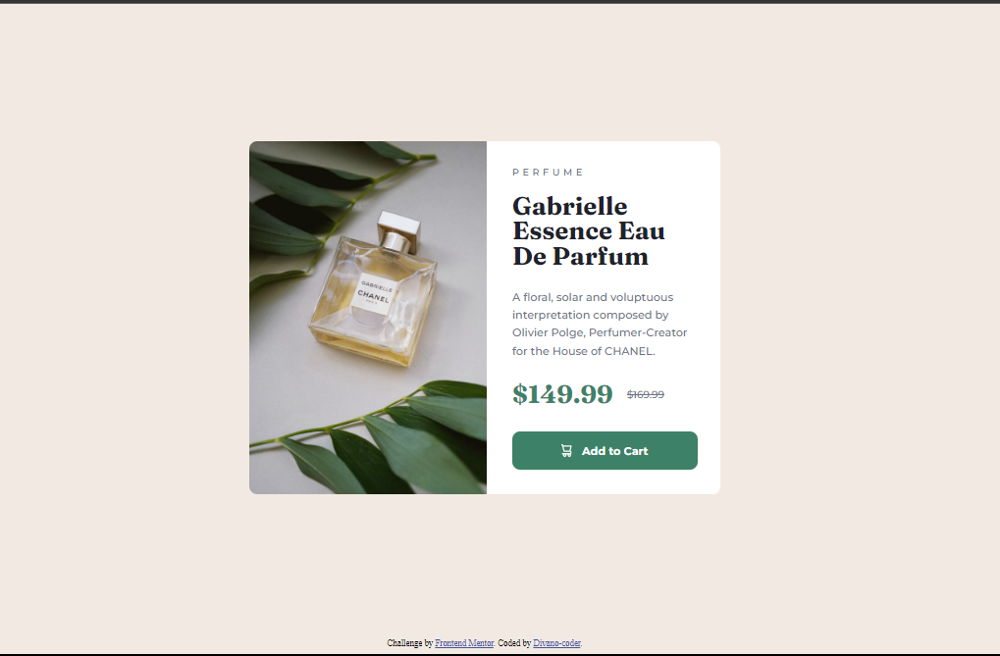
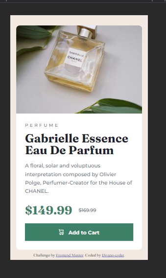

# Frontend Mentor - Product preview card component solution

This is a solution to the [Product preview card component challenge on Frontend Mentor](https://www.frontendmentor.io/challenges/product-preview-card-component-GO7UmttRfa). Frontend Mentor challenges help you improve your coding skills by building realistic projects.

## Table of contents

- [Overview](#overview)
  - [The challenge](#the-challenge)
  - [Screenshot](#screenshot)
  - [Links](#links)
- [My process](#my-process)
  - [Built with](#built-with)
  - [What I learned](#what-i-learned)
  - [Continued development](#continued-development)
- [Author](#author)

## Overview

### The challenge

Users should be able to:

- View the optimal layout depending on their device's screen size
- See hover and focus states for interactive elements

### Screenshot





### Links

- Live Site URL: [Product-preview-card-component](https://divano-coder.github.io/product-preview-card-component/)

## My process

### Built with

- Semantic HTML5 markup
- Flexbox
- Mobile-first workflow

### What I learned

During this project i learned how to position correclty a container in the bottom of the viewport using flex-grow. This help me with the attribution container.

```css
.grow-section {
  flew-grow: 1;
}
```

I olso learned how to use better flex containers changing the flex-direction to solve better the desings. And how to manage the html tags to don't have problems with their default styles.

### Continued development

I am goint to continue develop designs in front-end mentor, to earn confidence and level up the projects, because i am doing newbie works still.

## Author

- LinkedIn - [Divano De La Rosa](https://www.linkedin.com/in/divanodelarosa/)
- Frontend Mentor - [@Divano-coder](https://www.frontendmentor.io/profile/Divano-coder)
- CodeWars - [@Divano-coder](https://www.codewars.com/users/divanoCoder)
